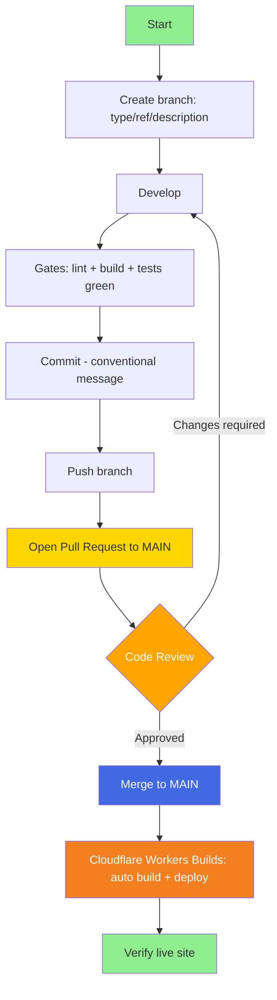

# Smart Management UI

**Smart Management UI** is the back-office/admin frontend for the Smart Management ecosystem, built as a modular monolith on Angular.

## Technology Stack

- **Framework**: Angular 22 (standalone components, Signals, zoneless-ready)
- **Styling**: SCSS
- **Tests**: Vitest + jsdom (`@angular/build:unit-test` builder)
- **Lint**: angular-eslint + eslint-plugin-boundaries (architecture enforcement)
- **Hosting**: Cloudflare Workers static assets (Workers Builds, `wrangler.jsonc`)
- **Node**: 24.19.0 (Angular CLI 22 requires >= 24.15.0)

## Architecture Overview

The app follows a **modular monolith** structure inspired by [kgrzybek/modular-monolith-with-ddd](https://github.com/kgrzybek/modular-monolith-with-ddd), translated to the frontend:

```
src/app/
├── shell/            # app composition: root routes, layout
├── shared-kernel/    # cross-cutting: correlation IDs, shared types
└── modules/          # bounded contexts
    └── <context>/
        ├── domain/           # pure TS models and ports (no Angular)
        ├── application/      # signals-first facades (use cases, state)
        ├── infrastructure/   # HTTP repositories implementing domain ports
        ├── ui/               # standalone OnPush components + routes
        └── index.ts          # the module's ONLY public API
```

- Cross-module imports go **only** through a module's `index.ts` (`@modules/*`), enforced by ESLint boundaries.
- Every HTTP request carries `X-Session-Id` and `X-Correlation-Id` headers (interceptor in `shared-kernel/correlation/`) for end-to-end tracing with the backend.
- State is **signals-first**; official Angular best practices are house rules.

Full documentation (ADRs, conventions, invariants, per-module pages) lives in the LLM wiki at [`vault/`](./vault/) — start at [`vault/index.md`](./vault/index.md).

# Getting Started

```bash
# Node via nvm
nvm use 24.19.0   # or: nvm install 24

npm ci
npm start          # ng serve -> http://localhost:4200
```

# Build and Test

```bash
npm run build      # ng build (production, zero-warning policy)
ng test --no-watch # Vitest suite
npm run lint       # angular-eslint + module boundary rules
```

All three must be green before any PR.

# Git Workflow

## Branch Naming Convention

Branches follow the pattern: `type/ref/description`

### Branch Types
- **feature** - new features
- **bugfix** - bug fixes
- **hotfix** - urgent fixes
- **chore** - tooling, deps, config
- **test** - testing and experimentation

### Name Structure
- **type**: one of the types above
- **ref**: GitHub issue number if one exists, otherwise `no-ref`
- **description**: short and clear

### Examples
```
feature/no-ref/administration-module
bugfix/12/fix-login-redirect
chore/no-ref/bump-angular-minor
```

## Workflow

Key difference from other projects: **`main` is the only long-lived branch, and every merge to `main` triggers an automatic build and deploy to Cloudflare** — merging is releasing.



## Detailed Process

1. **Create branch** (always from up-to-date `main`)
   ```bash
   git checkout main && git pull
   git checkout -b feature/no-ref/my-feature
   ```

2. **Develop with the gates green** — `npm run lint`, `npm run build` (zero warnings) and `ng test --no-watch` before every commit.

3. **Commit** using conventional messages
   ```bash
   git commit -m "feat: short description"
   ```

4. **Push and open a PR to `main`** — no direct pushes to `main`, ever.

5. **Review and merge** — after approval, the merge auto-deploys via Cloudflare Workers Builds. Verify the live site after merging.

## Deployment

- `wrangler.jsonc` points Cloudflare at `./dist/smart-management-ui/browser` with SPA fallback (`not_found_handling: single-page-application`).
- Workers Builds settings: build `npm run build`, deploy `npx wrangler deploy`, `NODE_VERSION=24.19.0`.
- Live: https://smart-management-ui.vitorafgomes.workers.dev
